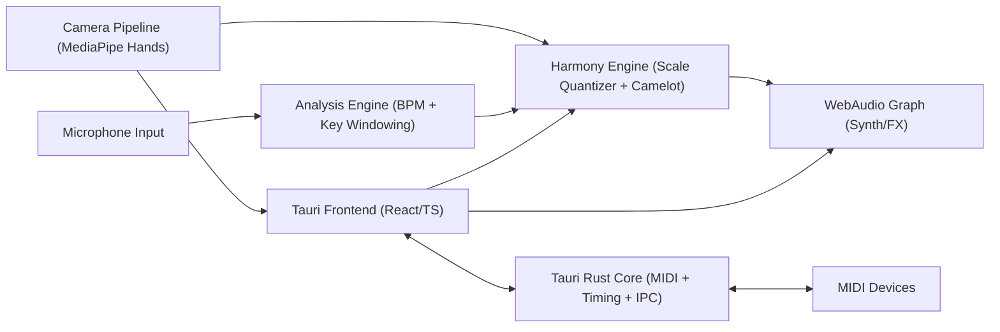

# Pulse: Architecture and Implementation Roadmap

Status: Draft v1  
Project: VETKA musical branch (`Pulse`)  
Date: 2026-02-22

## 1) Product goal

`Pulse` is a real-time musical companion for VETKA: it listens to incoming audio, tracks performer gestures, and plays back harmonically constrained synth lines.

MVP priority:
1. Real-time playability and low latency.
2. Stable hand-gesture control.
3. Basic rhythm/key awareness.
4. Manual harmonic transitions (Camelot shift), not full auto-harmony.

## 2) MVP scope (what we build first)

In scope:
1. Desktop app on macOS (Apple Silicon first).
2. Microphone input + camera input.
3. Hand tracking (pitch/volume/filter mapping).
4. Simple synth engine (1-2 oscillators + ADSR + 1-2 FX).
5. BPM estimation (windowed, smoothed).
6. Key estimation (2-4 sec window, confidence score).
7. Manual Camelot shift controls (+/-1, relative major/minor).
8. MIDI out and optional MIDI in mapping.

Out of scope for MVP:
1. Fully autonomous harmony progression every 2 bars.
2. Advanced autotune/harmonizer.
3. Multi-platform parity (Windows/Linux) from day one.
4. DAW-grade full plugin hosting.

## 3) High-level architecture



## 4) Component design

### 4.1 Frontend (Tauri + React/TypeScript)
Responsibilities:
1. Scene/UI controls (mode, sensitivity, shift, presets).
2. Gesture visualization overlays.
3. Transport/meters: BPM, key, confidence, latency.
4. Manual fallback controls (keyboard/mouse) when camera is noisy.

Key notes:
1. Keep UI thread light; offload heavy analysis from render-critical path.
2. Use requestAnimationFrame only for drawing and light state updates.

### 4.2 Gesture pipeline (MediaPipe Hands)
Responsibilities:
1. Detect landmarks for one or two hands.
2. Smooth landmark positions (EMA/low-pass).
3. Map gestures to control signals:
   - Left hand Y -> pitch index.
   - Right hand pinch/open -> volume.
   - Right hand X or wrist roll -> filter cutoff.
4. Publish normalized control events at fixed rate (for example 60 Hz).

### 4.3 Audio engine (WebAudio first)
Responsibilities:
1. Run oscillator voices and envelope.
2. Apply quantized pitch from Harmony Engine.
3. Apply basic FX chain (delay, reverb).
4. Accept control events from gestures and MIDI.

Design rules:
1. Avoid dynamic node creation per frame.
2. Prebuild graph and modulate parameters only.
3. Keep hard clipping guard and output limiter.

### 4.4 Analysis engine (BPM + Key)
Responsibilities:
1. Buffer microphone audio in sliding windows.
2. BPM estimation with smoothing/hysteresis.
3. Key estimation every 2-4 sec with confidence score.
4. Emit stable state only if confidence threshold is met.

MVP constraints:
1. Prefer robustness over fast fluctuation.
2. If confidence drops, freeze last valid key and mark uncertain.

### 4.5 Harmony engine (scales + Camelot)
Responsibilities:
1. Maintain active key/mode/scale.
2. Quantize pitch to active scale.
3. Apply manual Camelot operations:
   - Next/prev compatible key.
   - Relative major/minor switch.
4. Produce note events for monophonic lead + optional simple arp.

### 4.6 Rust core (Tauri backend)
Responsibilities:
1. MIDI input/output via `midir`.
2. Timing services and IPC boundary.
3. Optional low-level audio path fallback in later phase.

Why split:
1. JS/WebAudio is fastest for MVP iteration.
2. Rust handles device I/O deterministically.

## 5) Data flow and timing budget

Target (MVP):
1. Gesture-to-audio response: <= 35 ms perceived.
2. Stable frame rate in UI: >= 50 FPS on M-series Mac.
3. Analysis refresh:
   - BPM: every 500-1000 ms with smoothing.
   - Key: every 2-4 sec window.

Event channels:
1. `gesture.control` (pitchNorm, volumeNorm, filterNorm).
2. `analysis.state` (bpm, key, confidence, beatPhase).
3. `harmony.state` (camelotCode, scaleNotes, mode).
4. `midi.event` (in/out note, cc, clock optional).

## 6) Suggested repository layout for Pulse

```text
tools/pulse/
  README.md
  package.json
  src/
    app/
    ui/
    audio/
      graph.ts
      synth.ts
      effects.ts
    analysis/
      bpm.ts
      key_detection.ts
      smoothing.ts
    gesture/
      mediapipe.ts
      mapping.ts
      filters.ts
    harmony/
      camelot.ts
      scales.ts
      quantizer.ts
    state/
      store.ts
  src-tauri/
    src/
      main.rs
      midi.rs
      commands.rs
```

## 7) Roadmap (implementation phases)

## Phase 0: Foundations (0.5 day)
Deliverables:
1. `tools/pulse` scaffold on Tauri v2 + React/TS.
2. Mic/camera permissions and device picker UI.
3. Health panel (input detected, FPS, audio context running).

Exit criteria:
1. App opens reliably on macOS.
2. Camera and microphone streams are visible/active.

## Phase 1: Playable core (1 day)
Deliverables:
1. MediaPipe hands integrated.
2. Mapping: pitch + volume.
3. Monophonic synth (1-2 oscillators, ADSR).
4. Manual calibration panel (min/max hand ranges).

Exit criteria:
1. User can play notes continuously with hand movement.
2. No hard audio glitches in 10-minute session.

## Phase 2: Rhythm and key awareness (1 day)
Deliverables:
1. BPM estimator (windowed + smoothing).
2. Key estimator with confidence.
3. UI indicators for BPM/key/confidence.

Exit criteria:
1. BPM converges on steady beat tracks within acceptable tolerance.
2. Key output does not jitter excessively at rest.

## Phase 3: Harmony control (0.5-1 day)
Deliverables:
1. Camelot table + shift actions (+/-1, relative).
2. Scale quantizer wired to synth pitch.
3. Optional simple arp mode synced to BPM estimate or fixed BPM.

Exit criteria:
1. Manual shifts are audible and musically coherent.
2. Quantizer prevents out-of-scale notes.

## Phase 4: MIDI and hardening (1 day)
Deliverables:
1. MIDI out events and optional MIDI in mapping.
2. Presets (gesture sensitivity, synth params, harmony mode).
3. Error handling and fallback when camera/audio drops.
4. Performance logging overlay.

Exit criteria:
1. End-to-end jam session 20+ minutes without crash.
2. Reconnect flow works for device unplug/replug.

## Phase 5: v0.2 upgrades (post-MVP)
1. Automatic harmony movement by bar structure.
2. Better downbeat detection.
3. Polyphonic voices and richer FX routing.
4. Optional Rust/WASM DSP migration for tighter latency.

## 8) Risks and mitigations

1. Latency spikes under camera + audio load.  
Mitigation: fixed-size processing blocks, throttled UI updates, disable nonessential overlays.

2. Key detection instability in noisy/live material.  
Mitigation: confidence gating, hysteresis, freeze-on-uncertain mode.

3. Gesture jitter and user fatigue.  
Mitigation: smoothing, dead zones, customizable mapping curves, quick recalibration.

4. License conflicts from third-party DSP libs.  
Mitigation: start with permissive stack for core MVP; isolate GPL experiments.

## 9) Tooling and dependency guidance

Preferred MVP stack:
1. Tauri v2 + React + TypeScript.
2. MediaPipe Tasks Vision (hands).
3. WebAudio for synth/FX.
4. Rust `midir` for MIDI I/O.
5. Lightweight BPM/key implementation first; keep adapters for later replacement.

Dependency policy:
1. Every external library gets a one-line rationale in `tools/pulse/README.md`.
2. Track license in a dedicated `THIRD_PARTY_LICENSES.md`.

## 10) Definition of Done (MVP)

MVP is done when all are true:
1. Gesture-controlled synth is playable with stable latency.
2. BPM/key indicators are usable and do not flicker excessively.
3. Camelot manual shifts change harmonic context and quantization.
4. MIDI out works with at least one external synth/DAW.
5. 20-minute stability test passes on target macOS machine.
6. Basic docs exist: setup, controls, troubleshooting.

## 11) Execution checklist (short)

1. Scaffold `tools/pulse` Tauri app.
2. Integrate camera + MediaPipe hand landmarks.
3. Add synth graph and live control mapping.
4. Add BPM/key analysis with confidence/hysteresis.
5. Add Camelot engine + quantizer.
6. Wire MIDI I/O in Rust.
7. Run latency/stability pass and tune defaults.
8. Freeze MVP and tag `pulse-v0.1.0`.
